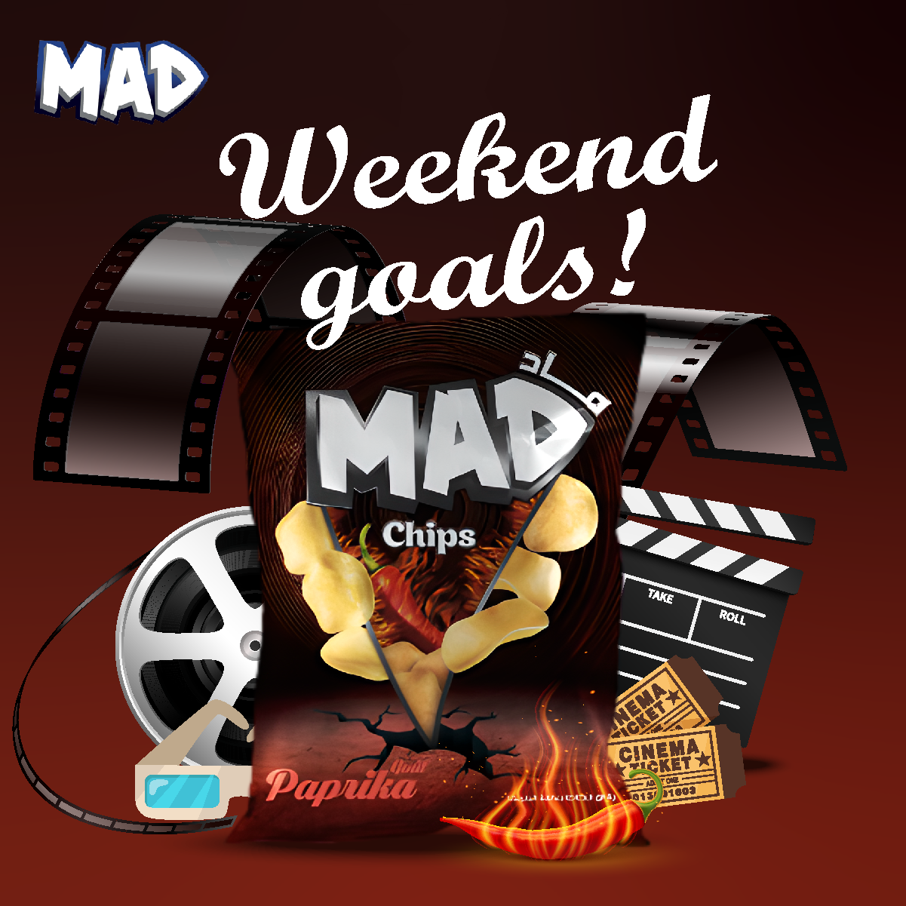
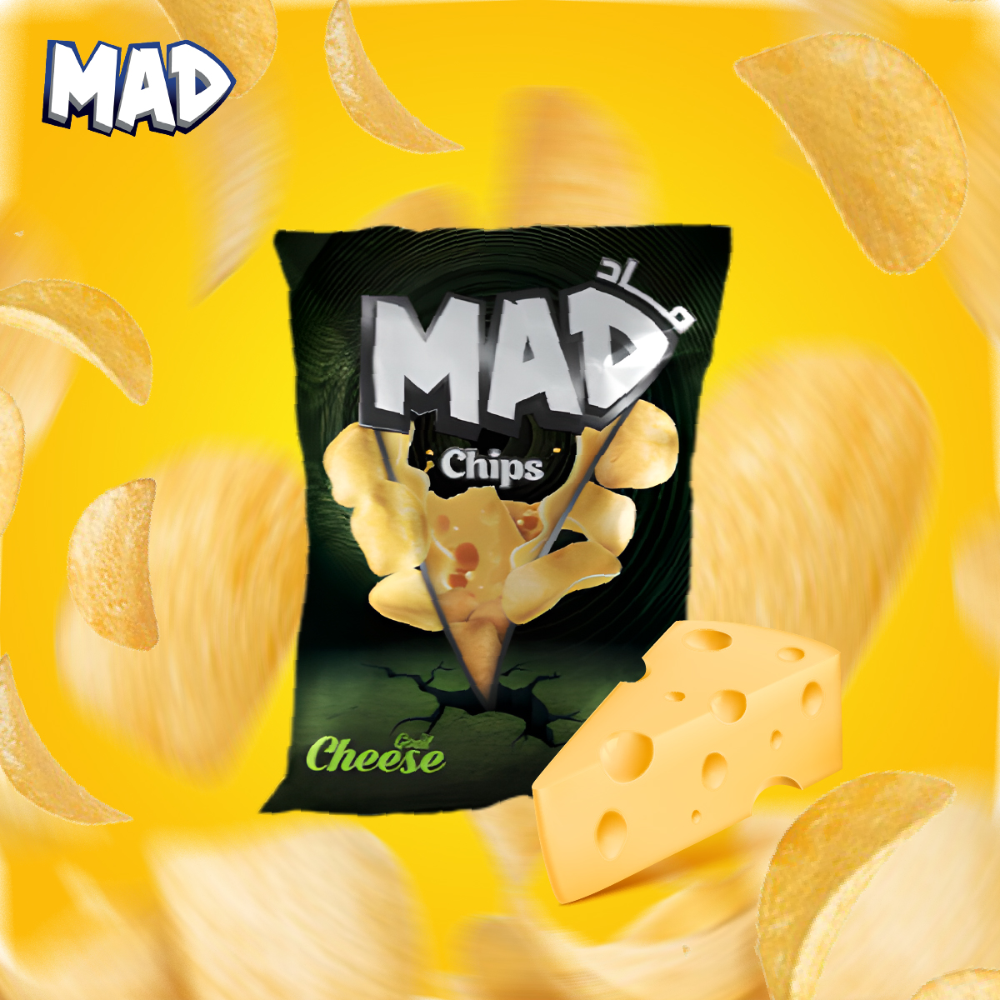

# Projet-Communication-Digitale

### Stratégie de Communication Digitale                                                                                                            
Déc. 2023 - Déc. 2023                                                                                                           
Associé à Institut Supérieur d'informatique et multimédia sfax                                                                                                    
                                                                                                                                                                    
Ce projet consiste à élaborer une stratégie de communication digitale pour promouvoir le produit à travers différentes plateformes sociales telles que Facebook et Instagram. La campagne, qui se déroule du 1er au 15 décembre 2023, intègre des publications sponsorisées et non sponsorisées. Elle vise à engager la communauté à travers des messages attractifs, des visuels de qualité, et des hashtags ciblés.

**Technologies : Adobe Illustrator · Design graphique · Réseaux sociaux · Communication stratégique**

|      Exemple 1      |       Exemple 2      |      Exemple 3       |
| --------------------| -------------------- | -------------------- |
|| | |

